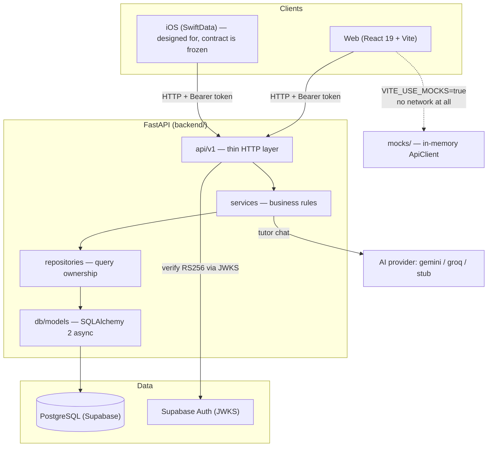
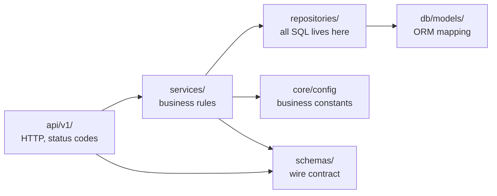
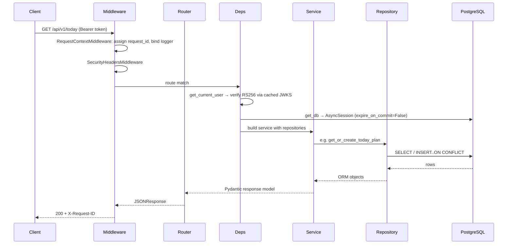
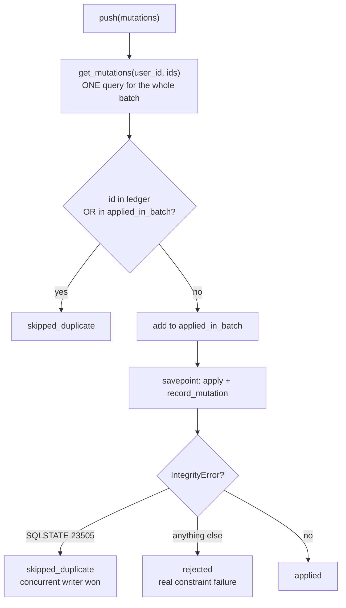
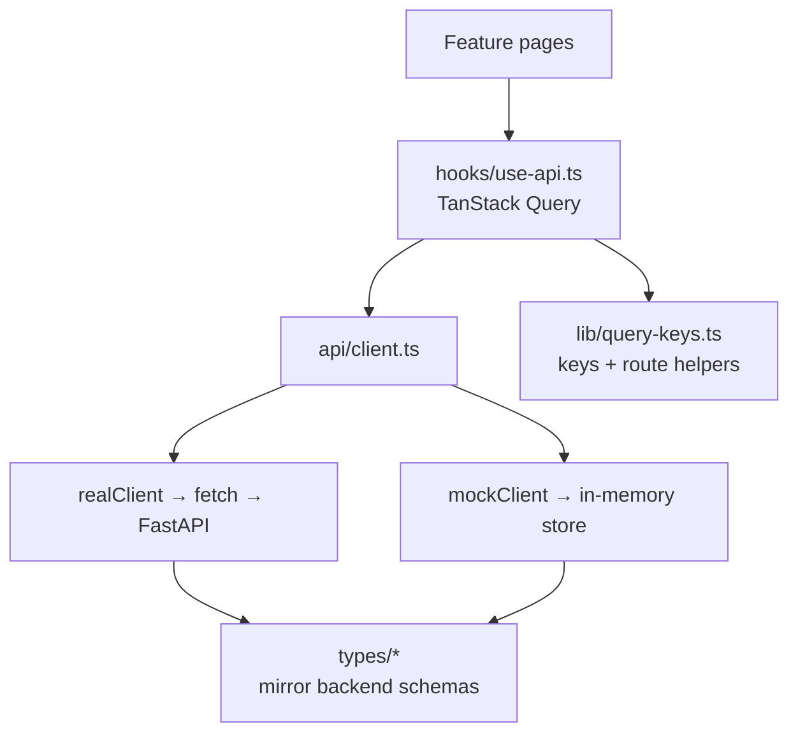
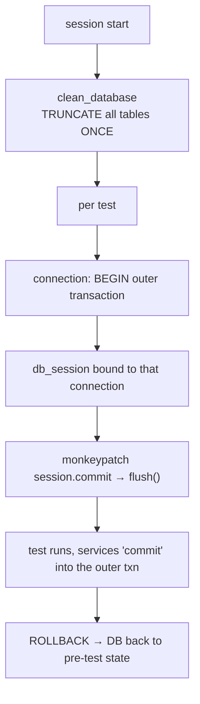

# InterviewReady — Architecture

Deep knowledge-transfer document. It explains **what the system is, how the layers fit
together, which invariants must never be broken, and why the design is the way it is.**

Audience: a new engineer joining the project, or future-you after three months away.

- Companion documents: [`WALKTHROUGH.md`](./WALKTHROUGH.md) (code-level tour),
  [`frontend/docs/DESIGN.md`](../frontend/docs/DESIGN.md) (UI design system),
  [`backend/docs/SCHEMA_MAPPING.md`](../backend/docs/SCHEMA_MAPPING.md) (DB mapping).
- Verified toolchain: Python 3.12, Node 26 / npm 11. See
  [§10 Running & verifying](#10-running--verifying) for the exact commands.

---

## Contents

1. [System in one page](#1-system-in-one-page)
2. [Technology choices](#2-technology-choices)
3. [Backend layering](#3-backend-layering)
4. [Request lifecycle](#4-request-lifecycle)
5. [The four hard problems](#5-the-four-hard-problems)
   - [5.1 Offline sync](#51-offline-sync)
   - [5.2 Spaced repetition](#52-spaced-repetition)
   - [5.3 Daily planning](#53-daily-planning)
   - [5.4 Streaks](#54-streaks)
6. [Data ownership & tenancy](#6-data-ownership--tenancy)
7. [Frontend architecture](#7-frontend-architecture)
8. [Cross-cutting invariants](#8-cross-cutting-invariants)
9. [Test architecture](#9-test-architecture)
10. [Running & verifying](#10-running--verifying)
11. [Extension points](#11-extension-points)

---

## 1. System in one page

Two deployable units. The backend owns all state and all business rules; the frontend is a
client that can also run entirely standalone against an in-memory simulation of the same
contract.



**Why two clients matter architecturally.** The iOS client is offline-first: it queues
mutations and replays them whenever connectivity returns. That single requirement
determines a large fraction of the backend design — every write must be idempotent, every
read must be cursor-resumable, and **the server clock and server versions are always
authoritative**. Anywhere you see "server-authoritative" in a comment, it is a consequence
of this constraint.

### Scale of the codebase

| Area | Files | Notes |
|---|---:|---|
| `backend/app` | 89 `.py` | api → services → repositories → models |
| `backend/tests` | 11 `.py` | 285 tests, real PostgreSQL |
| `frontend/src` | 99 `.ts/.tsx` | features, api layer, mocks, UI kit |
| Alembic migrations | 2 revisions | `0001` adapts legacy schema, `0002` adds new tables |

---

## 2. Technology choices

### Backend

| Choice | Why | Cost accepted |
|---|---|---|
| **FastAPI** | Pydantic-native request/response validation; auto OpenAPI, which the iOS client is generated against. | Framework-coupled models; mitigated by keeping ORM models separate from schemas. |
| **SQLAlchemy 2 (async) + asyncpg** | Async I/O throughout so one worker handles many concurrent requests. | Async correctness is easy to get wrong — see [§9](#9-test-architecture) on loop binding and `NullPool`. |
| **Supabase Auth via JWKS** | Verification is stateless (no session table, no extra round trip per request). | Key rotation handling required; see `app/core/jwks.py`. |
| **Config-driven business rules** | The spaced-repetition ladder, daily plan size and streak thresholds live in `Settings`, not in code. Both clients get new behaviour with no release. | Rules are less discoverable than constants in a function. Mitigated by `Settings` docstrings. |
| **Layered services** | Business rules are testable without HTTP; repositories own every query. | More indirection. Worth it — the sync bug in `WALKTHROUGH.md` was only tractable because layers were separable. |

### Frontend

| Choice | Why |
|---|---|
| **React 19 + TypeScript strict** | `noUnusedLocals`/`noUnusedParameters`/`verbatimModuleSyntax` catch dead code and type-only import mistakes at build time. |
| **Vite** | Fast HMR; `chunkSizeWarningLimit` raised for Monaco. |
| **TanStack Query v5** | Server state is *not* application state. Caching, retries, invalidation and optimistic updates are solved problems; hand-rolling them is where stale-UI bugs come from. |
| **React Router v7** | Route-level `lazy()` for heavy pages (Monaco, Recharts) keeps the initial bundle small. |
| **Tailwind v4 (CSS-first)** | Design tokens are CSS custom properties, so dark/light theming — including Recharts colours — needs no JavaScript. |
| **Radix primitives** | Accessibility (focus trapping, ARIA, keyboard nav) is genuinely hard; only `Slot` is used directly, the rest informed hand-built components. |

### Deliberate omissions

- **No code execution.** Monaco stores code as text; there is no compiler or sandbox. Adding
  one would be a large security surface for little pedagogical gain.
- **No client-side streak or revision math.** Both are computed server-side so web and iOS
  cannot disagree.
- **No Redux / global store.** TanStack Query holds server state; `useState` holds UI state.

---

## 3. Backend layering

Strict one-directional dependency flow. A layer may call the layer below it and nothing
above it.



| Layer | Directory | Owns | Must NOT |
|---|---|---|---|
| Routers | `app/api/v1/` | HTTP shape, status codes, dependency wiring | Contain business logic or SQL |
| Services | `app/services/` | Business rules, orchestration, transaction boundaries | Build SQL or import FastAPI |
| Repositories | `app/repositories/` | Every query, every upsert | Contain business rules |
| Models | `app/db/models/` | Table mapping, constraints, relationships | Be used as API responses |
| Schemas | `app/schemas/` | The wire contract | Touch the DB |

**Why this matters in practice.** The bug documented in `WALKTHROUGH.md` was a *repository*
defect (returning a stale ORM object) that surfaced as a *service* symptom (a missed
conflict). Because the layers were separable, a one-line probe at the repository boundary
isolated it in minutes. Respect the boundaries.

### Two schema families

There are deliberately **two** representations of progress:

- `ProgressSummary` — embedded in catalog listings. Compact; **has no `revision_count`**.
- `ProgressResponse` — returned by progress endpoints. Fuller; does have `revision_count`.

This is not an oversight. Catalog rows are returned in bulk and should not carry every
field. The practical consequence for client authors: **never assume a field exists because a
similarly-named type has it.** The frontend hit this exact error during development.

---

## 4. Request lifecycle



**Middleware order** (`app/main.py`): CORS → GZip → Security headers → Request context.
Request context is innermost so the `request_id` is bound for everything before it.

**Error handling is centralised** (`app/api/error_handlers.py`). Every failure — including
framework-level validation errors and bare Starlette 404s — is normalised to one envelope:

```json
{"error": {"code": "PROBLEM_NOT_FOUND", "message": "DSA problem not found", "details": null}}
```

Database exceptions are mapped by class: `IntegrityError`, `OperationalError`,
`InterfaceError`, `SQLAlchemyError` each produce a stable code. Clients therefore parse one
shape and never see a raw stack trace.

### Routers mounted (`app/api/v1/router.py`)

`users` · `today` · `dsa` · `revisions` · `lld` · `hld` · `study-sessions` · `stats` ·
`sync` · `ai` · `settings`

Mount order determines the section order in `/docs`.

---

## 5. The four hard problems

Everything else in the backend is CRUD. These four are where the design effort lives.

### 5.1 Offline sync

The riskiest subsystem: **a bug here silently loses or duplicates a user's study history.**

`POST /api/v1/sync/push` — apply a batch of queued mutations.
`GET /api/v1/sync/pull` — changes after a server-issued cursor.

#### Three guarantees

| Guarantee | Mechanism |
|---|---|
| **Idempotency** | Client-generated `mutation_id`, recorded in `sync_mutations` with a unique constraint on `(user_id, mutation_id)`. A replay returns the original result instead of re-applying. |
| **Optimistic concurrency** | The mutation states the `base_version` it last saw. If the row moved on, the server returns `conflict` **plus its current record** so the client can merge rather than clobber. |
| **Server-authoritative ordering** | The pull cursor is `sync_changes.seq`, a global identity column — never a device timestamp. Two changes sharing a timestamp still get distinct ordered cursors, and deletes are represented explicitly. |

#### Dedupe happens in two places — both are required



- **The ledger** catches replays *across* requests.
- **`applied_in_batch`** catches duplicates *within* one batch. It is necessary because the
  ledger row for the first occurrence is only written once its savepoint commits, so a
  second identical mutation later in the same batch would otherwise also apply.

#### Why each mutation gets its own savepoint

`async with self._sync.session.begin_nested()` wraps each mutation's data write **and** its
change-log write. Consequences:

- One malformed mutation cannot roll back the whole batch — the others still commit.
- A mutation's data and its change-log entry are atomic together, so a client can never pull
  a change whose data was rolled back.
- A failure inside the savepoint leaves the outer transaction usable.

#### The `IntegrityError` trap

An `IntegrityError` means "already applied" **only** when it is a unique violation. A
`NOT NULL`, `CHECK` or foreign-key violation means the write *did not happen* — reporting it
as `skipped_duplicate` claims success and silently discards the user's change. Hence
`_is_unique_violation()` (SQLSTATE `23505`, with a message fallback). See
`WALKTHROUGH.md` for the full case study; this was one of three stacked bugs.

### 5.2 Spaced repetition

`app/services/revision_policy.py` is the single definition of "when should this be reviewed
next". It performs **no database access** so it can be unit-tested directly, and it is used
by the revision service, the daily planner and the sync path.

**The ladder is configuration, not code.** `REVISION_INTERVALS_JSON` maps confidence (0–5)
to a list of day-intervals, indexed by completed revision count:

| Confidence | Ladder (days) | Meaning |
|---:|---|---|
| 0 | `[1]` | Unrated — re-check tomorrow |
| 1 | `[1, 3]` | Struggling |
| 2 | `[2, 5, 12]` | Shaky |
| 3 | `[3, 7, 16, 35]` | Getting there |
| 4 | `[5, 14, 35, 75, 150]` | Solid |
| 5 | `[7, 21, 60, 120, 240, 365]` | Mastered |

`revision_count` indexes the ladder and is **clamped to the last entry**, so a
long-reviewed item keeps the maximum interval rather than running off the end.

Two rules are intentionally *not* configurable:

- **A failed review always returns in 1 day**, regardless of the ladder. Failure is a
  signal, not a scheduling input.
- **Priority** is derived, not stored arbitrarily: failed/low-confidence → 5 (urgent),
  manual/stale → 4, otherwise inherited from confidence (`0→5, 1→4, 2→4, 3→3, 4→2, 5→1`).

Higher priority means "show this first".

### 5.3 Daily planning

`app/services/daily_plan_scheduler.py` — described in its own docstring as *"the most
business-critical service in the application."* It decides what the user studies today, for
every client, from one implementation.

**Determinism is the primary property.** `GET /api/v1/today` must never hand the user a
different plan on refresh. The result is a pure function of
`(catalog, user state, plan_date)` — no `random`, no "now"-dependent jitter inside the
ranking. A seeded tiebreak provides day-to-day variety while remaining reproducible within
a day. Once computed, **the winner is persisted, and the persisted plan is the authority**
from then on.

Candidates are scored rather than naively taking "next 3 unsolved by `order_index`":

| Signal | Purpose |
|---|---|
| Curriculum position | Keep early plans foundational |
| Difficulty ramp | Match difficulty to how far into the curriculum the user is |
| Importance | Interview frequency |
| Topic weakness | Attack what the user is bad at |
| Prior exposure | Prefer new material until coverage is adequate |
| Staleness | Resurface things not seen in a while |

The difficulty ramp is a table of bonuses keyed by `(difficulty, stage)` — e.g. `hard` is
*punished* at stage 0 (`-10.0`) and *rewarded* at stage 3 (`+12.0`). The version string
`SCHEDULER_VERSION = "scheduler_v1"` is stored so a future algorithm change can be detected
against plans already persisted.

### 5.4 Streaks

`app/services/streak_service.py`. **Server-authoritative** — neither client computes a
streak, so both always show the same number.

Input is the materialised `user_activity_days` ledger, not raw attempts/revisions/sessions.
This keeps it a single indexed read no matter how much history accumulates.

The one subtle rule: **a streak is still "alive" if the user has not studied yet today but
did yesterday.** Otherwise opening the app in the morning would show the streak as broken
and demotivate the user before they have had a chance to study. A gap of more than one day
genuinely breaks it.

"Active day" is configuration (`STREAK_MIN_MINUTES`, `STREAK_MIN_ACTIVITIES`), re-derivable
via `ActivityRepository.recompute_is_active`.

---

## 6. Data ownership & tenancy

**The user id always comes from the verified token's `sub` claim.** A `user_id` in a request
body or query string is ignored. This is stated in the OpenAPI description, and it is the
single most important security invariant in the system — every repository method takes
`user_id` as a required keyword, so "forgot to scope the query" is visible at the call site
rather than hidden in a global filter.

Isolation is tested explicitly: `test_pull_is_isolated_between_users`,
`test_today_is_isolated_between_users`, `test_another_user_cannot_mutate_my_plan_item`.

**Legacy schema.** The project was built onto an **existing Supabase database**: six
pre-existing tables and all user data were preserved, and the ORM was mapped onto them
rather than replacing them. Consequences you will meet:

- `user_problem_progress` uses `_date`-suffixed column names (`solved_date`,
  `next_revision_date`) predating the LLD/HLD tables' `next_revision_at`.
- `problem_id` is `TEXT`, not `UUID`, and has **no foreign key** to the catalog — the column
  predates the catalog and holds values the seed may not contain. Ids are validated in the
  service layer instead.
- `confidence` is `NOT NULL DEFAULT 3` (non-nullable), unlike the nullable 0–5 range used
  elsewhere in the API.

See `SCHEMA_MAPPING.md` for the full table-by-table mapping.

---

## 7. Frontend architecture

### The dual client — the central decision

`src/api/contract.ts` declares one `ApiClient` interface. It has **two implementations**:

| Implementation | File | Behaviour |
|---|---|---|
| `realClient` | `src/api/endpoints/all.ts` | Thin HTTP wrappers over the FastAPI routes |
| `mockClient` | `src/mocks/client.ts` | Full stateful in-memory backend with simulated latency |

`src/api/client.ts` binds exactly one:

```ts
export const api: ApiClient = USE_MOCKS ? mockClient : realClient;
```

Components import `api` and nothing else, so switching to the live backend is a one-line
environment change (`VITE_USE_MOCKS=false`). Because the mock implements the same interface,
**it cannot drift from the real contract without a type error** — the TypeScript compiler
enforces the contract in both directions.

`VITE_USE_MOCKS` defaults to **true**, so `npm run dev` works with no backend, no
credentials and no database. `@supabase/supabase-js` is imported dynamically, so mock mode
never loads it.

### Data flow



**Types mirror the backend schemas module-for-module** (`types/dsa.ts` ↔
`schemas/dsa.py`, and so on). Where the UI needs a derived shape it derives it in the
component rather than inventing a parallel type.

**Query invalidation follows the domain, not the endpoint.** Solving a problem invalidates
the catalog, the revision queue, Today's plan *and* the statistics together, because all
four are affected. Leaving any of them stale is what makes a dashboard feel wrong.

### Runtime configuration

`src/api/config.ts` resolves everything once at module load:

| Setting | Default | Meaning |
|---|---|---|
| `VITE_USE_MOCKS` | `true` | Render from the in-memory layer |
| `VITE_API_BASE_URL` | `/api/v1` | Proxied to the backend by Vite in dev |
| `MOCK_LATENCY_MS` | `220` | Artificial latency so loading states are exercised honestly |
| `STALE_TIME_MS` | `30_000` | Freshness window before a background refetch |
| `STORAGE_KEYS` | `ir-*` | Namespaced localStorage keys |

---

## 8. Cross-cutting invariants

Break one of these and you have a bug, even if tests pass.

1. **The server is the only authority on time, version and ordering.** Never trust a device
   clock. Never compute a streak or an interval client-side.
2. **`user_id` comes from the token and nowhere else.**
3. **Every write is an upsert and must be idempotent.** The iOS client replays queues.
4. **A mutation's data write and its change-log write must be atomic** (same savepoint).
5. **Only a unique violation means "already applied".** Everything else means the write did
   not happen and must be surfaced as a rejection.
6. **Any upsert whose returned row feeds a version comparison must go through
   `upsert_returning`**, never `build_upsert_statement` directly. See
   [`WALKTHROUGH.md`](./WALKTHROUGH.md) — violating this hid two other bugs.
7. **Server defaults exist for the INSERT path only.** They must never appear in the
   `DO UPDATE` clause, or a partial payload resets stored data.
8. **Business rules live in config**, not in services, so both clients stay in sync.
9. **ORM models are not API responses.** Map through schemas at the boundary.

---

## 9. Test architecture

285 tests against a **real PostgreSQL** instance — not SQLite, because the code depends on
PostgreSQL-specific behaviour (`ON CONFLICT`, `RETURNING`, SQLSTATE codes, identity columns).

### Isolation strategy



Three things worth understanding:

- **`NullPool` + one event loop per session.** Async engines and connections are loop-bound;
  a pooled connection created in one loop cannot be reused from another
  ("attached to a different loop"). A fresh connection per checkout keeps each test
  self-contained.
- **`session.commit` is replaced with `flush()`.** Production gives every request its own
  session; the suite shares one so the work can be rolled back. Flushing preserves the
  `commit()` contract the services rely on.
- **The outer transaction means tests compose freely.** Each test sees a clean database
  without paying for a schema rebuild.

> ⚠️ **Never run two pytest processes concurrently.** They share one test database and
> `clean_database` truncates only once per session. Concurrent runs produce phantom
> `NotNullViolationError` and `ProgrammingError` failures that look exactly like product
> bugs. This cost real debugging time — recorded here so it does not cost it twice.

### Test files

| File | Covers |
|---|---|
| `test_sync.py` | Push, pull, idempotency, conflict resolution — the riskiest area, 32 tests |
| `test_dsa.py` | Catalog, progress, attempts, notes, code |
| `test_today.py` | Plan generation, persistence, item completion, isolation |
| `test_topics.py` | LLD / HLD curricula |
| `test_stats.py` | Analytics, topic mastery, streaks |
| `test_users.py` | Identity, export |
| `test_auth.py` | Token verification, 401 behaviour |
| `test_ai.py` | Tutor chat, conversation history |
| `test_units.py` | Pure units (revision policy, schedulers) — no DB needed |
| `test_harness.py` | The test infrastructure itself |
| `conftest.py` | Fixtures |

---

## 10. Running & verifying

> **Paths matter.** The virtualenv and env file live in `backend/`, not the repo root.
> Running `.venv/bin/uvicorn` from the root fails with exit 127 / `command not found`.

### Backend

```bash
cd backend
set -a && . ./.env && set +a
exec .venv/bin/uvicorn app.main:app --host 127.0.0.1 --port 8000 --log-level info
```

- API `http://localhost:8000` · Swagger UI `/docs` · ReDoc `/redoc` · readiness `/health/ready`

### Backend tests

```bash
cd backend
export TEST_DATABASE_URL="postgresql+asyncpg://postgres@127.0.0.1:55432/interviewready_pytest"
.venv/bin/python -m pytest -q
# → 285 passed
```

Lint: `.venv/bin/python -m ruff check <paths>`.
There are **6 pre-existing findings** in `sync_service.py` (`UP035` + 5× unused
`noqa: BLE001` where the rule is disabled). They are not from current work.

### Frontend

```bash
cd frontend
npx tsc -b --noEmit    # typecheck (strict)
npm run build          # tsc -b && vite build
npm run dev            # http://localhost:5173, proxies /api → :8000
```

> If `node`/`npm` are not on your `PATH`, they may live under `~/.local/bin`. In a sandboxed
> shell, `cd` inside the wrapper can resolve to the workspace root — prefer
> `npm --prefix /abs/path/to/frontend run dev`.

### macOS notes

- There is **no `timeout` command**. Do not reach for it in scripts; use a background
  process and `kill` instead.

---

## 11. Extension points

Where to make common changes, and what to watch.

| Task | Touch | Watch out for |
|---|---|---|
| **Tune the revision ladder** | `REVISION_INTERVALS_JSON` in config — no code change | Clamping means a shortened ladder collapses long-reviewed items onto its last value |
| **Change daily plan size** | `Settings` (`daily_dsa_count` default) | Persisted plans are authoritative — existing plans do not shrink |
| **Add a sync entity** | `SyncEntity` enum, a handler in `sync_service.py`, register in the dispatch map | The handler must write its change-log entry in the same savepoint |
| **Add an API endpoint** | Router → service → repository, in that order | Never put SQL in a router or business rules in a repository |
| **Change streak definition** | `STREAK_MIN_*` config, then `recompute_is_active` | Stored flags must be re-derived, not just read |
| **Swap the AI provider** | `AI_PROVIDER` env (`gemini` / `groq` / `stub`) | Provider must be built in lifespan or the tutor 503s; see `app/services/ai/factory.py` |
| **Add a frontend screen** | `features/<domain>/pages/`, add the route in `app/App.tsx` | Use `api` only — never import a concrete client |
| **Point the frontend at the real API** | `VITE_USE_MOCKS=false` | Endpoints and types are already aligned; no code change needed |

**Known TODOs** are tracked at the end of `backend/README.md`.
