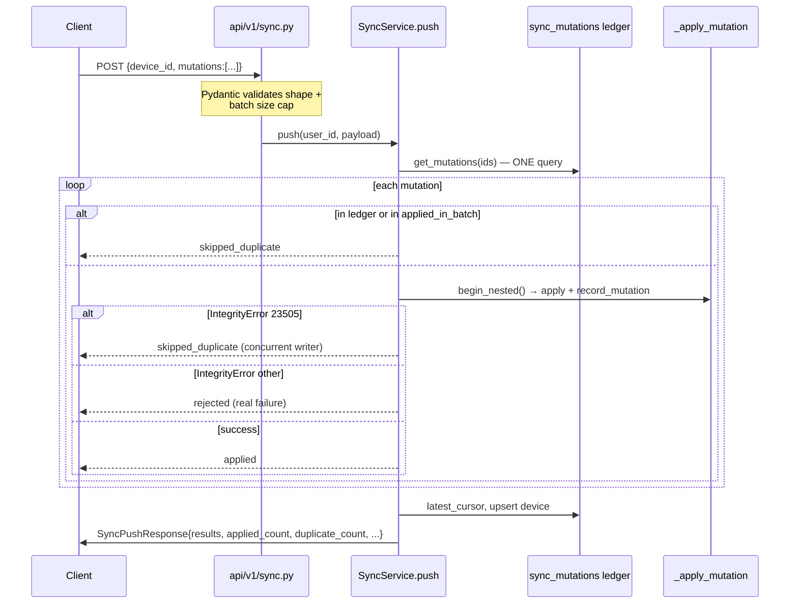
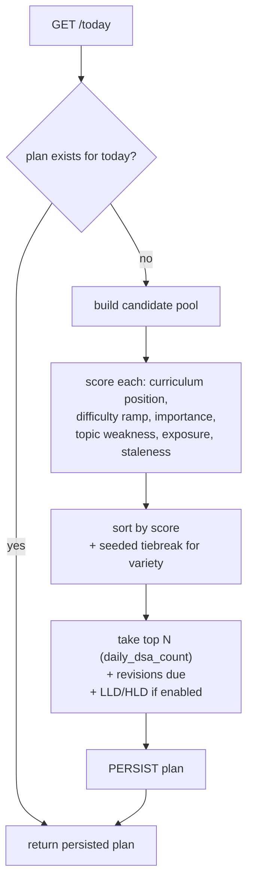
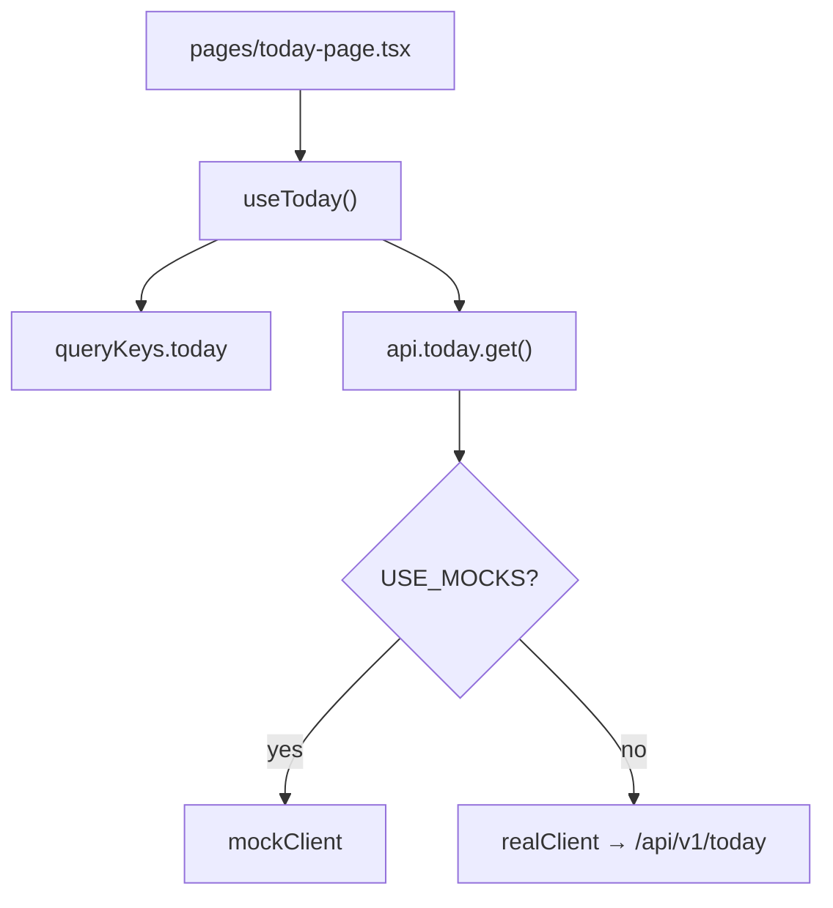

# InterviewReady — Walkthrough

Code-level knowledge transfer. Where [`ARCHITECTURE.md`](./ARCHITECTURE.md) explains *what
the system is*, this document explains **how to actually work in it**: in what order to read
the code, what happens on a real request, how to debug, and every trap that cost time.

It ends with the [work log](#10-work-log--summary-of-changes) — what was built and fixed.

---

## Contents

1. [Reading order](#1-reading-order)
2. [Trace: a REST request end to end](#2-trace-a-rest-request-end-to-end)
3. [Trace: a sync push end to end](#3-trace-a-sync-push-end-to-end)
4. [Trace: today's plan generation](#4-trace-todays-plan-generation)
5. [Backend conventions in practice](#5-backend-conventions-in-practice)
6. [Frontend: how a screen is built](#6-frontend-how-a-screen-is-built)
7. [Case study: the three stacked sync bugs](#7-case-study-the-three-stacked-sync-bugs)
8. [Debugging playbook](#8-debugging-playbook)
9. [Gotchas catalogue](#9-gotchas-catalogue)
10. [Work log — summary of changes](#10-work-log--summary-of-changes)

---

## 1. Reading order

Do **not** start with the routers. They are deliberately thin and will teach you nothing
about the system. Read in this order:

```mermaid
graph LR
    A["1. README.md<br/>what & why"] --> B["2. core/config.py<br/>every business rule"]
    B --> C["3. core/constants.py<br/>enums = shared vocabulary"]
    C --> D["4. schemas/sync.py<br/>the hardest contract"]
    D --> E["5. services/revision_policy.py<br/>purest logic, no DB"]
    E --> F["6. services/sync_service.py<br/>all guarantees together"]
    F --> G["7. services/daily_plan_scheduler.py<br/>scoring & determinism"]
    G --> H["8. api/v1/ + deps.py<br/>now the HTTP layer makes sense"]
```



**Why this order.** `Settings` contains the business rules, so it tells you what the product
actually does before you look at any code. `constants.py` defines the vocabulary every other
file shares. `sync.py` is the most demanding contract, and understanding it makes the rest
look simple. `revision_policy.py` has no database access, so it is pure logic you can hold
entirely in your head. By the time you reach the routers, you already know what they call.

### Frontend reading order

```
1. src/api/contract.ts        ← the interface everything depends on
2. src/api/config.ts          ← env flags, defaults
3. src/api/client.ts          ← the one-line dual-client switch
4. src/types/dsa.ts           ← wire shapes
5. src/hooks/use-api.ts       ← every query/mutation
6. src/app/App.tsx            ← route table
7. src/features/today/pages/today-page.tsx  ← a real screen
8. src/mocks/client.ts        ← a working reference implementation of the API
```

`src/mocks/client.ts` is unexpectedly useful: it is a complete, runnable implementation of
every endpoint, so it doubles as executable documentation of the contract.

---

## 2. Trace: a REST request end to end

`PUT /api/v1/dsa/problems/{problem_id}/progress` — the most important write in the app.

### Step 1 — Router (`app/api/v1/dsa.py`)

A router does four things and nothing else: declare the path, declare the response model,
pull dependencies, call one service method.

```python
@router.put("/problems/{problem_id}/progress", response_model=ProgressResponse)
async def update_progress(
    problem_id: str,
    payload: ProgressUpdateRequest,
    user: AuthenticatedUser = Depends(get_current_user),
    service: DSAService = Depends(get_dsa_service),
) -> ProgressResponse:
    return await service.update_progress(
        user_id=user.id, problem_id=problem_id, payload=payload
    )
```

Notice `user_id=user.id` — **taken from the verified token, never from the request body.**

### Step 2 — Service (`app/services/dsa_service.py`)

This is where the real work is. Read `update_progress` top to bottom; the flow is:

1. **Validate the problem exists** — `catalog_repo.get_with_progress`. A typo must not create
   orphan progress, because there is no FK to the catalog (legacy schema).
2. **Load existing progress.**
3. **Accumulate `values`** — only fields the client actually sent.
4. **Derive side effects from a status transition:**
   - `not_started` → clear derived timestamps (a reset must not look solved)
   - `solved` / `mastered` → set `solved_date`, ask the revision policy for the next due
     date, upsert an open revision; then tick off today's plan item and record activity
   - `needs_revision` → bring it back tomorrow at max priority
5. **Nothing to change?** Return current state rather than issuing a pointless write.
6. **Persist** via `progress_repo.upsert`.
7. **Commit**, then return `_to_response(row)`.

Two details that are easy to miss and important:

- **`time_spent_minutes` accumulates on the REST path** (`prior + clamp_minutes(...)`) but is
  treated as *authoritative* on the sync path. The offline client has already merged its own
  delta locally, so adding it again would double-count. This asymmetry is deliberate.
- **Activity is only recorded for a meaningful status change**, not for any write:

  ```python
  # Not "any write": a favourite toggle or a confidence tweak should not extend a streak.
  if values.get("status") is not None and values["status"] != ProblemStatus.NOT_STARTED.value:
  ```

### Step 3 — Repository (`app/repositories/dsa.py`)

All SQL lives here. `upsert` builds an `INSERT ... ON CONFLICT DO UPDATE ... RETURNING` and
**must** route through `upsert_returning` — see
[§7](#7-case-study-the-three-stacked-sync-bugs) for what happens if it does not.

### Step 4 — Response

`_to_response(row)` maps the ORM object to `ProgressResponse`. **ORM models are never
returned directly** — they would leak columns and couple the wire format to the schema.

---

## 3. Trace: a sync push end to end

`POST /api/v1/sync/push`. Read `SyncService.push` alongside this.



### Why one query for the whole batch

```python
already = await self._sync.get_mutations(
    user_id=user_id, mutation_ids=[m.mutation_id for m in payload.mutations]
)
```

A batch is typically 10–50 mutations. One `IN (...)` beats 50 round trips, and a whole-batch
retry (the common case after a network failure) hits the ledger for every item.

### Why two dedupe sources

The ledger only contains mutations already **committed**. Consider a batch containing the
same mutation twice — the first occurrence's ledger row is written when its savepoint
commits, but the loop has already moved on:

```python
applied_in_batch: set[uuid.UUID] = set()   # catches duplicates WITHIN this batch
```

Both are required. Removing either reintroduces a double-apply.

### Why `_field_filter` drops `None`

```python
return {k: v for k, v in payload.items() if k in allowed and v is not None}
```

Two reasons: an unknown key would raise on the model and turn a whole mutation into a
rejection, so silently ignoring it lets a newer client push a field an older server does not
know yet. And dropping `None` means **"absent" and "explicit null" are equivalent** — which
matters for the `status` handling below.

### The savepoint

```python
async with self._sync.session.begin_nested():
    result = await self._apply_mutation(...)
    await self._sync.record_mutation(...)
```

Data and change-log entry are atomic together. A client can never pull a change whose data
was rolled back, and one bad mutation cannot take down the batch.

---

## 4. Trace: today's plan generation

`GET /api/v1/today`. `POST`-like behaviour on a `GET` is intentional — the first call of the
day creates the plan.



**The critical property:** once persisted, the stored plan is the authority. Re-requesting
must never regenerate. This is why the ranking must be a pure function of
`(catalog, user state, plan_date)` — if it depended on wall-clock time inside the ranking,
a refresh at 23:59 could produce a different plan than 00:01 and the user would see their
list change under them.

The difficulty ramp is a lookup table, not a formula:

```python
_DIFFICULTY_RAMP_WEIGHT = {
    "easy":   {0: 12.0, 1:  6.0, 2:  1.0, 3: -4.0},
    "medium": {0:  4.0, 1: 12.0, 2: 10.0, 3:  2.0},
    "hard":   {0: -10.0, 1: -3.0, 2:  8.0, 3: 12.0},
}
```

`hard` is *penalised* at stage 0 and *rewarded* at stage 3. Tables like this are easy to
tune and easy to explain to a non-engineer; a formula would be neither.

`GET /api/v1/today/explain` exposes the per-candidate reasoning — genuinely useful when
someone asks "why am I seeing this problem?"

---

## 5. Backend conventions in practice

### Services receive repositories, never sessions

```python
def __init__(
    self, *, sync_repo, device_repo, progress_repo, ..., settings: Settings
) -> None:
```

Keyword-only, explicit. Consequences: a service is unit-testable with fakes, and
"which tables does this touch?" is answerable by reading the constructor.

### Repositories take `user_id` as a required keyword

```python
async def get(self, *, user_id: uuid.UUID, problem_id: str) -> UserProblemProgress | None:
```

Missing tenancy scoping is then a **type error at the call site**, not a silent data leak.

### Upserts are the default write

Every user-facing write is an upsert, because the iOS client replays queued changes. The
helpers in `app/utils/upsert.py` exist so `version` bumps and `updated_at` refreshes are
never forgotten in one service but not another.

Three helpers, and the distinction matters:

| Helper | Purpose |
|---|---|
| `build_upsert_statement` | Builds the `ON CONFLICT DO UPDATE` statement. **Does not refresh the returned ORM object.** |
| `upsert_returning` | Same, plus `.execution_options(populate_existing=True)`. **Use this.** |
| `apply_server_defaults` | Fills NOT NULL columns that have a `server_default`, keeping them out of `DO UPDATE`. |

**Rule: if the returned row feeds a version comparison, use `upsert_returning`.**

### Errors

Raise typed exceptions from `app/core/exceptions.py`; `error_handlers.py` converts them to
the single envelope. Database exceptions map by class. Never return `{"error": ...}`
manually — the handler owns the shape.

---

## 6. Frontend: how a screen is built

Follow `features/today/` as the reference implementation.



### The five-step recipe

1. **Types first** — confirm the wire shape exists in `src/types/`. If the backend has it,
   the type should already be there; if not, add it mirroring the schema exactly.
2. **Hook** — add a query/mutation in `hooks/use-api.ts` using `queryKeys` and `api`. Never
   call `api` from a component directly.
3. **Invalidate by domain** — a mutation must invalidate every cache it affects. Solving a
   problem touches catalog + revisions + today + stats.
4. **Components** — build from `components/ui/` primitives and `components/shared/` domain
   components. Reuse before adding.
5. **Route** — register in `app/App.tsx`. Use `lazy()` for heavy pages (Monaco, Recharts).

### Rules that keep the codebase coherent

- **Import `api`, never a concrete client.** This is what makes mock mode free.
- **Domain labels resolve through `lib/status.ts`.** A badge in a table, a filter chip and a
  chart legend then always agree.
- **No `useEffect` for data fetching.** TanStack Query owns it.
- **Optimistic updates only where latency is user-visible** — ticking off a Today item, and
  nothing else.

---

## 7. Case study: the three stacked sync bugs

The most instructive incident in the project. A single failing test
(`test_duplicate_mutations_within_one_push_apply_once`) was the visible symptom of **three
independent defects**, each hiding the next.

### Bug 1 — the validator rejected valid input

`SyncPushRequest._cap_mutations` raised a 422 on any batch containing a repeated
`mutation_id`:

```python
# BEFORE — wrong
seen: set[uuid.UUID] = set()
for mutation in value:
    if mutation.mutation_id in seen:
        raise ValueError(f"Duplicate mutation_id in request: {mutation.mutation_id}")
    seen.add(mutation.mutation_id)
```

But a device retrying an offline queue can legitimately contain a duplicate, and rejecting
the batch means it can **never drain** — every retry gets 422 forever. Meanwhile
`SyncService.push` already had complete dedupe logic producing `skipped_duplicate` results,
so the validator made that logic unreachable. The test documented the intended contract:

> *"A batched retry can contain the same mutation twice."*

**Fix:** removed the in-batch rejection (batch-size cap kept); dedupe is the handler's job.

### Bug 2 — a partial update wrote `status = NULL`

`_upsert_progress` built its columns purely from the payload. `user_problem_progress.status`
is `NOT NULL` with **no** `server_default`, so a push like
`{"problem_id": "...", "confidence": 5}` inserted `status = NULL`:

```
NotNullViolationError: null value in column "status" of relation "user_problem_progress"
```

The subtlety: PostgreSQL validates the proposed insert row **before** `ON CONFLICT`
resolution, so this happened even when the row already existed with a perfectly good status.

**Fix:** supply `status` for the INSERT's benefit, but exclude it from `DO UPDATE` via
`preserve_columns` so the stored value survives. The check reads the raw payload
(`mutation.payload.get("status") is None`) because `_field_filter` drops `None` — treating
absent and explicit-null alike, or a null status would reset a solved problem.

### Bug 3 — the stale ORM object that hid 1 and 2

This was the real discovery. `ProblemProgressRepository.upsert` called
`build_upsert_statement` directly, bypassing `upsert_returning`:

```python
# BEFORE — returns a stale identity-mapped object
stmt = build_upsert_statement(UserProblemProgress, payload, conflict_columns=keys)
result = await self.session.execute(stmt)
return result.scalars().one()
```

Because sessions are created with `expire_on_commit=False`, and the test suite shares one
session across a whole test, `.returning(model)` handed back the **already-loaded ORM object
with pre-upsert attributes**. Evidence from a probe at the repository boundary:

```
PROBE_REPO_ROW: payload={... 'confidence': 5} -> version=1 status=solved confidence=3
                          ^ requested 5                          ^ stale 3
```

Consequences — and note how each one *masked* an upstream failure:

| Symptom | Why it mattered |
|---|---|
| `version` never advanced | The optimistic-concurrency check read a stale version, so a **stale write was reported as `applied` instead of `conflict`**. |
| Field values were stale | Callers and responses saw pre-write data. |
| **`IntegrityError` was mislabelled** | Bug 2's NOT NULL violation was caught and returned as `skipped_duplicate` — *"applied by a concurrent request"*. So a **failed write was reported as already applied**, silently discarding the user's change. |

That third row is why bug 2 was invisible to the test suite: the write failed, and the API
said it succeeded.

**Fix, two parts:**

```python
# 1. Route through the refreshing helper
return await upsert_returning(
    self.session, UserProblemProgress, payload,
    conflict_columns=keys, update_columns=update_columns,
)

# 2. Classify IntegrityError by SQLSTATE — only a unique violation means "already applied"
def _is_unique_violation(exc: IntegrityError) -> bool:
    orig = getattr(exc, "orig", None)
    sqlstate = getattr(orig, "sqlstate", None) or getattr(orig, "pgcode", None)
    if sqlstate == "23505":
        return True
    return "uniqueviolation" in str(orig or exc).lower().replace(" ", "")
```

Anything that is not a unique violation is now surfaced as `rejected` with the real message.

### The lesson

The codebase **already contained the fix and documented the hazard** in
`upsert_returning`'s docstring:

> *"Without it, a session that loaded the row earlier would keep returning the pre-upsert
> `version`, which would break the optimistic-concurrency checks the sync protocol depends
> on."*

One code path bypassed the helper. **When a helper exists with a docstring explaining a
hazard, find every path that does not use it.**

### Baseline established before fixing

| | `test_sync.py` |
|---|---|
| Original code | **11 failures** |
| After fixes | **32 passed** (3 new regression tests) |
| Full suite | **285 passed** |

The baseline mattered: without it I could not have told whether the change improved things or
just moved the failures around.

### Regression tests added

| Test | Guards |
|---|---|
| `test_partial_progress_mutation_inserts_without_a_status` | Bug 2 — insert with a partial payload |
| `test_partial_progress_mutation_preserves_the_existing_status` | Bug 2 — partial update must not reset status |
| `test_pushed_partial_update_bumps_the_stored_version` | Bug 3 — the returned row must be post-write |

I verified the third is load-bearing by temporarily removing `populate_existing`: the test
failed with `assert 1 > 1`, exactly the stale-version signature.

---

## 8. Debugging playbook

Techniques that worked here, in the order to try them.

### 1. Establish a baseline before changing anything

Run the failing tests, then revert your change and run again. "3 failures" means nothing
without knowing the original was 11. Back up files (`cp x.py /tmp/x.bak`) when there is no
git repo — there was not one here.

### 2. Reproduce the failing thing at its own level

Do not debug a 422 by reading the validator. Send the request and read the response:

```
STATUS: 422
BODY: {"error":{"code":"VALIDATION_ERROR","details":[{"field":"mutations",
       "message":"Value error, Duplicate mutation_id in request: ..."}]}}
```

One probe replaced several rounds of speculation.

### 3. Walk outward one boundary at a time

Probe at the *boundary*, not the site. Printing the row the repository returned — rather than
the field the test asserted on — is what exposed bug 3.

### 4. When an `except` swallows an error, make it re-raise

The fastest way to reveal a masked exception:

```python
except IntegrityError as exc:
    print("PROBE:", type(exc).__name__, repr(exc)[:900], file=sys.stderr)
    raise
```

This turned "why is this a duplicate?" into "it is a `NotNullViolationError` on `status`"
immediately. **Always remove probes afterwards** (`grep -rn "PROBE_" app/ tests/`).

### 5. Read the docstrings of helpers you are not calling

Bug 3 was pre-documented in `upsert_returning`. Searching for `populate_existing` found it in
seconds.

### 6. Distrust flaky multi-process test results

Wildly varying counts (139 errors, then 190 vs 285 collected) were caused by **my own
concurrent pytest runs** sharing one test database. It looked exactly like a product bug.
Run tests serially; if results are inconsistent, suspect the harness before the code.

### 7. Test the test

Temporarily break the thing a new test claims to guard and confirm it fails. A regression
test that cannot fail is documentation, not protection.

---

## 9. Gotchas catalogue

Every trap that cost time in this project. Grouped by where you will hit it.

### Backend

| Gotcha | Detail |
|---|---|
| **venv/env location** | `.venv` and `.env` are in `backend/`, not the repo root. Running `.venv/bin/uvicorn` from the root gives exit 127. |
| **`timeout` does not exist on macOS** | Do not use it in scripts; use a background process and `kill`. |
| **Test DB URL** | Tests skip silently without `TEST_DATABASE_URL` set. |
| **Concurrent pytest runs** | Share one test database → phantom `NotNullViolationError` / `ProgrammingError`. Run serially. |
| **`expire_on_commit=False` + long-lived session** | `.returning(model)` can hand back a stale identity-mapped object. Use `upsert_returning`. |
| **NOT NULL without a `server_default`** | `apply_server_defaults` cannot fill it. `user_problem_progress.status` is the example — supply it, but keep it out of `DO UPDATE`. |
| **`ON CONFLICT` validates the proposed row first** | A NOT NULL violation fires even when the row exists and the column would not be updated. |
| **`IntegrityError` ≠ duplicate** | Only SQLSTATE `23505` means "already applied". |
| **`_field_filter` drops `None`** | "absent" and "explicit null" are equivalent when checking whether a payload provided a field. |
| **`ProgressSummary` has no `revision_count`** | Only `ProgressResponse` does. Use `problem.revisions.length` instead. |
| **`time_spent_minutes` is added on REST, authoritative on sync** | The offline client already merged its delta. |
| **Legacy columns** | `user_problem_progress` uses `_date` suffixes; `problem_id` is `TEXT` with no FK. |
| **6 pre-existing ruff findings** | In `sync_service.py` (`UP035` + unused `noqa: BLE001`). Not yours; leave them. |

### Frontend

| Gotcha | Detail |
|---|---|
| **`verbatimModuleSyntax`** | Type-only imports must use `import type` or inline `type`. |
| **`noUnusedLocals` / `noUnusedParameters`** | An unused import fails the build. |
| **Recharts v3 `formatter`** | Param is `ValueType \| undefined`; `(value: number) => ...` fails. Use `(value) => String(value)`. |
| **Mock ids must be seeded from a constant** | Routes are `/dsa/:problemId`, `/lld/:topicId`, `/hld/:topicId`. Timestamp-seeded ids changed on every reload and broke every link. |
| **Monaco `lightbulb: { enabled: 'off' }`** | Rejected by the installed typings; the option was removed. |
| **`const` section tuples** | `LLD_NOTE_SECTIONS` / `HLD_NOTE_SECTIONS` lack the `placeholder`/`rows` the editor needs — map to `NoteSectionSpec[]` at the call site. |
| **`LLDNotes` / `HLDNotes` have no index signature** | Generic editors need a typed `readNote(notes, key)` helper, not `notes[key]`. |
| **Sandboxed `cd`** | In a sandboxed shell, `cd` inside the wrapper can resolve to the workspace root; prefer `npm --prefix <abs path>`. |
| **Node not on `PATH`** | May be under `~/.local/bin`. |

---

## 10. Work log — summary of changes

### Frontend — built from scratch (`frontend/`)

A complete React 19 + TypeScript + Vite application, 99 source files, against the spec for
DSA, LLD, HLD, spaced revision, progress tracking and an AI tutor.

| Deliverable | Detail |
|---|---|
| Design system | `frontend/docs/DESIGN.md` — IA, page hierarchy, navigation, user flows, tokens, ASCII wireframes, component inventory, responsive rules |
| Dual API layer | `ApiClient` interface with `realClient` + full `mockClient`; `VITE_USE_MOCKS` picks one |
| Types layer | Mirrors `backend/app/schemas/*` module-for-module |
| Screens | Today, DSA catalog + problem workspace, Revisions (+ active-recall session), LLD catalog + workspace, HLD catalog + workspace, Statistics, AI Tutor, Settings, Login, 404 |
| Components | 12 UI primitives, 6 shared domain components, cross-feature `CurriculumCatalog` / `TopicNotesEditor` / `DesignWorkspaceShell` |
| Shell | Collapsible sidebar, header, `⌘K` command palette with global search |

**Verification:** `tsc -b --noEmit` clean; `npm run build` succeeds; all 8 routes checked in a
browser with **zero page errors**.

### Backend — sync subsystem fixed

Starting point: `test_sync.py` had **11 failures**.

| File | Change |
|---|---|
| `app/schemas/sync.py` | Removed the in-batch duplicate rejection that made a stuck queue unable to drain. |
| `app/services/sync_service.py` | Added in-batch dedupe (`applied_in_batch`); defaulted `status` for the insert path only; excluded it from `DO UPDATE` via `preserve_columns`; added `_is_unique_violation()` so only a genuine unique violation is reported as a duplicate. |
| `app/repositories/dsa.py` | Routed the progress upsert through `upsert_returning` so the returned row is post-write; added `preserve_columns`. |
| `tests/test_sync.py` | 3 regression tests covering the partial-payload insert, status preservation, and version bumping. |

**Result:** `test_sync.py` 11 failures → **32 passed**; full suite **285 passed**; ruff clean
apart from the 6 pre-existing findings.

### Documentation added

| File | Contents |
|---|---|
| `docs/ARCHITECTURE.md` | System overview, technology rationale, layering, request lifecycle, the four hard problems, tenancy, frontend architecture, invariants, test architecture, extension points |
| `docs/WALKTHROUGH.md` | This file — reading order, request traces, conventions, the bug case study, debugging playbook, gotchas, work log |
| `frontend/docs/DESIGN.md` | UI design system and wireframes |

### Environment notes discovered

- `.venv` and `.env` live in `backend/`; running from the repo root fails with exit 127.
- macOS has no `timeout` command.
- `node`/`npm` may live under `~/.local/bin`; sandboxed `cd` can resolve elsewhere.
- Tests need `TEST_DATABASE_URL` or they skip silently.
- **Never run two pytest processes concurrently** — they share one test database.
